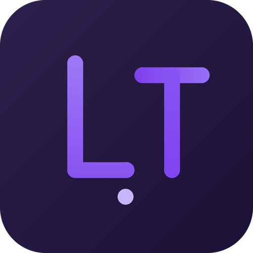

<p align="center">
  
</p>

<h1 align="center">LightTab</h1>

<p align="center">
  A minimal, calm, fast new-tab page for Chrome.<br>
  <b>Local-first by default · zero tracking · optional cloud sync</b>
</p>

<p align="center">
  
  
  
  
</p>

---

Live clock and greeting (with the Chinese lunar calendar), a local month view, one-box search,
an AI prompt launcher, a grouped icon grid, to-dos and wallpapers — all of it stored in your own
browser. The extension requests a single permission (`storage`) and makes no network requests
unless you explicitly turn on an online feature (cloud sync, Bing daily wallpaper library).

## Features

- **Clock & greeting** — live time, date and a time-of-day greeting, plus the Chinese lunar calendar (sexagenary year, zodiac, leap months, 1900–2100, computed entirely on-device). The clock can sit in the left column or lifted above the search box as a large centred time line (phone-launcher style)
- **Bilingual UI (English / 中文)** — switch the whole interface in *Settings → General → Language*. Greetings, dates, the lunar line, calendar, engine names, menus and messages all follow. Persisted locally, applied instantly, no reload
- **Calendar widget** — local month view with lunar-day labels and month navigation (zero network)
- **One-box search** — URL shortcuts (bare domains with paths work, e.g. `github.com/susunola`), 6 search engines, 2 AI chats (Doubao, ChatGPT) and a WorkBuddy deep link. When WorkBuddy Desktop is running it is shown live in the engine list via a local loopback probe (no extra permissions)
- **AI prompt launcher** (press `/`) — pick a template, type your content, and send the same prompt to several targets at once. The prompt text never travels in the URL (it goes through a nonce channel in extension mode); if the target page blocks auto-fill, the prompt is copied to your clipboard with an on-page notice
- **Icon grid** — drag to reorder, groups, and a built-in brand-icon library so no favicon is ever fetched from a third party
- **Free canvas layout** — on wide screens every widget and card can be dragged anywhere; cards snap to a grid and swap places with whatever is already there
- **To-dos**, **6 curated gradient wallpapers**, custom image upload, and an optional Bing daily wallpaper library
- **Weather widget** (opt-in, off by default) — current temperature, condition, today's high/low and humidity for a city you pick in Settings, powered by Open-Meteo (no API key, CORS-open). Cached for 30 minutes; shows the last reading with a "may be outdated" hint when the network fails
- **JSON backup / restore** and one-click Chrome bookmark import (optional permission)
- **Optional cloud sync** — sign in with an email to sync shortcuts, to-dos, settings, wallpaper and templates across devices over HTTPS. Off by default

## Privacy

- Single required permission: `storage` — everything lives in your own browser
- No tracking, no analytics, no ads
- Zero network requests in the default configuration. Only three **opt-in** features ever reach the network:
  - **Cloud sync** — email sign-up/login (only a password hash is stored server-side); whole-document last-write-wins sync keeps multiple devices consistent. Your token stays local and is never synced. Over HTTPS to the self-hosted backend at `lighttab.atomwangnus.com`
  - **Bing daily wallpaper library** — when you open it in settings, metadata and images are fetched via the backend proxy at `lighttab.atomwangnus.com`
  - **Weather widget** — off by default; only after you enable it and set a city does the page fetch forecasts directly from `api.open-meteo.com` (and city geocoding from `geocoding-api.open-meteo.com`) over HTTPS. No account, no API key, no other data leaves the browser
- The optional `bookmarks` permission is requested only at the moment you click "import from bookmarks"

See [privacy.html](./privacy.html) for the full policy.

## Install

**Chrome Web Store** — not published yet; please install via developer mode for now.

**Developer mode**
1. Clone this repo
2. Open `chrome://extensions`
3. Enable **Developer mode** (top right)
4. Click **Load unpacked** and select this folder

## Tech

- Chrome Extension Manifest V3
- Plain HTML / CSS / vanilla JS — zero dependencies, zero build step
- `chrome.storage.local` with a `localStorage` fallback (so `file://` preview works)
- Schema-versioned migrations
- i18n is a flat local dictionary plus `[data-i18n]` DOM hooks — no runtime library
- Offline smoke checks: `node scripts/smoke.cjs` (syntax / manifest / version consistency / pure-function assertions)

## Structure

```
lighttab/
├── manifest.json          # MV3 manifest (storage + optional bookmarks)
├── newtab.html            # entry page
├── privacy.html           # privacy policy
├── css/style.css
├── js/
│   ├── app.js             # main logic (storage / clock / search / grid / settings / drag)
│   ├── i18n.js            # zh + en dictionary, t() runtime, static DOM pass
│   ├── icondb.js          # built-in brand-icon library (simple-icons, CC0)
│   ├── lunar.js           # Chinese lunar calendar, with English name variants
│   ├── sync.js            # optional cloud sync client (local-first, LWW)
│   └── inject-ai.js       # content script that auto-fills Doubao / ChatGPT
├── scripts/
│   └── smoke.cjs          # offline smoke checks (node scripts/smoke.cjs)
├── assets/                # logo + social preview (and the script that renders them)
└── icons/                 # 16 / 48 / 128
```

## License

[MIT](./LICENSE)
