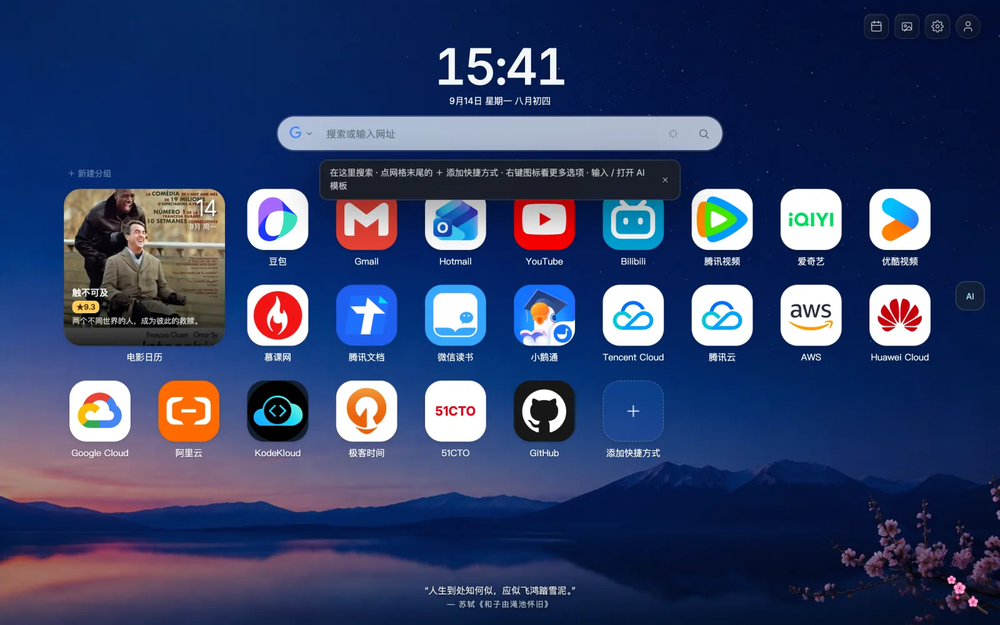
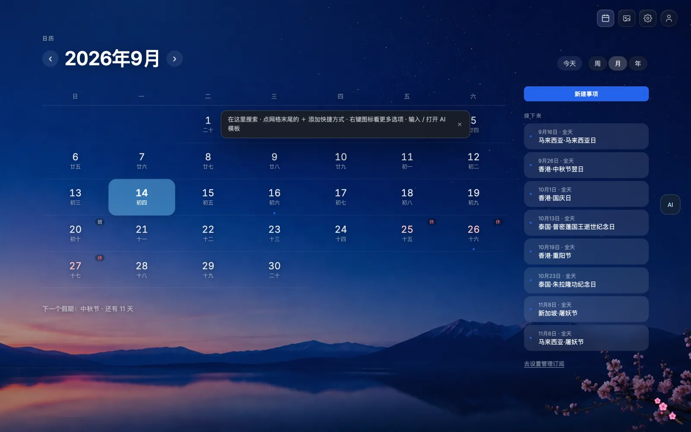
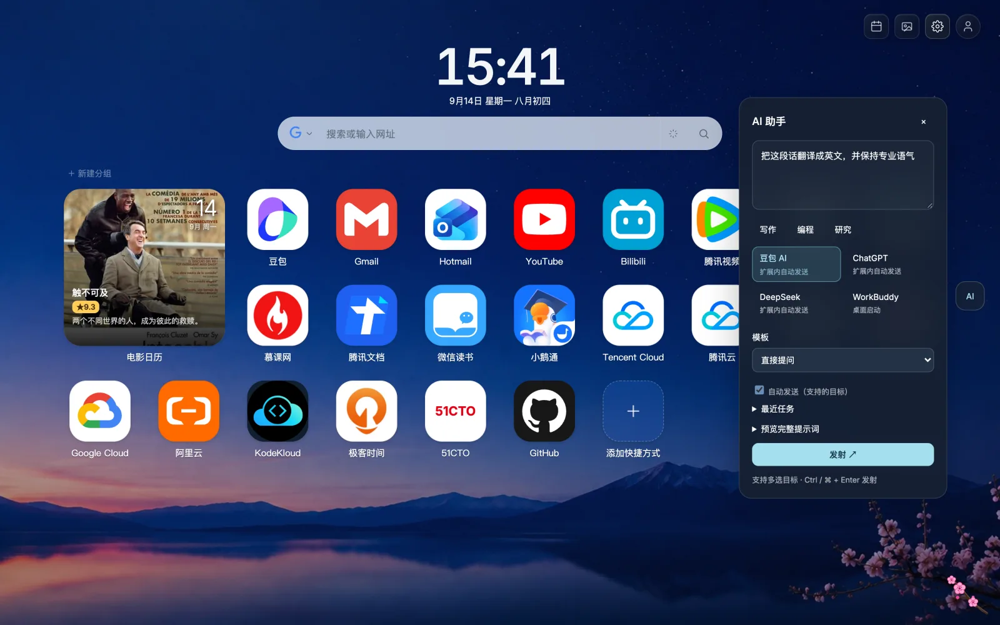
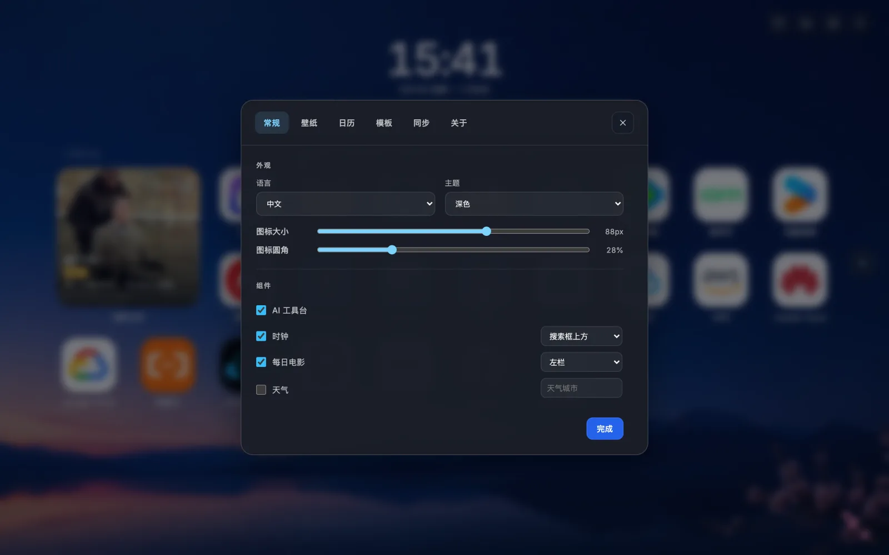

<p align="center">
  
</p>

<h1 align="center">LightTab</h1>

<p align="center">
  A minimal, calm, fast new-tab page for Chrome.<br>
  <b>Local-first by default · zero tracking · optional cloud sync</b>
</p>

<p align="center">
  
  
  
  
  
</p>

<p align="center">
  
</p>

---

LightTab replaces your new-tab page with a live clock and greeting (Chinese lunar calendar
included), one-box search, a grouped icon grid, a full calendar page, an AI prompt launcher and a
movie-of-the-day card — all stored in your own browser. The only required API permission is
`storage`; everything online (cloud sync, wallpaper library, weather) is optional and off until you
turn it on.

## Screenshots

<table>
  <tr>
    <td></td>
    <td></td>
    <td></td>
  </tr>
  <tr>
    <td align="center"><b>Calendar page</b><br>month / week / year, lunar labels, holiday feeds</td>
    <td align="center"><b>AI launcher</b><br>one prompt to several targets, verified send</td>
    <td align="center"><b>Settings</b><br>theme, language, icon geometry, widgets</td>
  </tr>
</table>

## Features

- **Clock & greeting** — live time, date and a time-of-day greeting, plus the Chinese lunar calendar (sexagenary year, zodiac, leap months, 1900–2100, computed entirely on-device). The clock can sit in the left column or lifted above the search box (phone-launcher style), switches between 24h and 12h (AM/PM · 上午/下午), can show seconds, and offers three face fonts (modern / serif / mono)
- **Calendar page** — a dedicated second page (top-left button) with month / week / year views, lunar-day labels and Chinese statutory-holiday badges (休/班), plus a countdown line to the next holiday. Ships with one bundled, zero-network **港新马印泰假期** feed (HK/SG/MY/ID/TH public holidays 2026–2028, removable — deleting it is sticky on the device). You can also subscribe to **read-only iCalendar feeds** (published iCloud / Google / Outlook links) or import `.ics` files; recurring rules, `TZID`, ordinal `BYDAY` and `EXDATE` are all expanded on-device, and nothing is ever written back to the source calendar
- **One-box search** — URL shortcuts (bare domains with paths work), 6 search engines, AI chats and a WorkBuddy deep link. Live suggestions from Baidu / Google / Bing (fetched directly; switchable off in Settings). Tab / Shift+Tab cycles engines; a pure arithmetic expression (e.g. `128 × 3.5`) shows an inline result row — Enter copies it, no `eval()`; the last 10 searches stay local and resurface below the box
- **AI prompt launcher** (press `Alt+Shift+A` or the side button) — pick a template, type once, and send the same prompt to several targets at once: Doubao, ChatGPT and DeepSeek via a content script that fills and verifies the send (Enter-first submission, button detection as fallback), WorkBuddy via its desktop deep link. The prompt never travels in the URL — it goes through a short-lived nonce channel in extension storage — and a bare `?q=` link from any other website can fill but **never auto-send**. Per-target delivery status is reported back to the launcher, and a target that never answers within 20 s is flagged with the prompt copied to your clipboard
- **Icon grid** — drag to reorder, hold a tile over another to group them into an iOS-style folder (2×2 mini-icon tile, inline rename, drag-out to ungroup; folders auto-dissolve below 2 items), custom groups, and a built-in brand-icon library so no favicon is ever fetched from a third party. Tile size and corner radius are adjustable; the ＋ dialog derives the name from the URL you type and can prefill from the current tab (optional `tabs` permission, requested on click). One-click Chrome bookmark import (optional `bookmarks` permission, also requested on click)
- **Free canvas layout** — on wide screens, widgets and the icon grid can be dragged anywhere; cards snap and swap. The movie card's placement (*Settings → Widgets*) selects the layout engine: **Left column** integrates it into the grid, **Above search** switches to the free canvas — live, no reload. A refused drag explains why and offers a one-click fix
- **Movie of the day** — a daily pick from a curated annual-best list with poster, rating and a short note; works fully offline, with an optional hot list when online
- **Wallpapers** — bundled gradient/photo wallpapers, custom image upload, and an optional Bing daily wallpaper library with favorites and daily auto-rotate
- **Weather** (opt-in) — current conditions and a 7-day outlook for a city you pick, powered by Open-Meteo (no API key); cached 30 minutes with a stale-data hint
- **Bilingual UI (English / 中文)** — one switch in Settings re-renders everything instantly
- **JSON backup / restore** and **optional cloud sync** — email sign-in syncs shortcuts, settings, wallpaper and templates over HTTPS; first-login differences and concurrent edits pause the affected document for an explicit choice, and local recovery backups are taken before any replacement

## Privacy

- Required API permission: `storage` only. No tracking, no analytics, no ads
- Everything online is optional and off by default: cloud sync, wallpaper library, weather, calendar subscriptions
- **Search suggestions** (on by default, switchable) are sent directly to your chosen search engine (Baidu / Google / Bing)
- **Calendar feed URLs never leave the device** — a published calendar link is an unguessable key, so it stays in local storage, excluded from sync and exports. Feed hosts are requested on demand via a single HTTPS-only `optional_host_permissions` wildcard; plaintext `http://` feeds are rejected
- **AI launching** happens through the target's own page (content scripts declared for Doubao, Dola, ChatGPT and DeepSeek); auto-send requires a nonce written by the extension itself
- **WorkBuddy detection** probes `127.0.0.1` ports 18488–18490 on startup to detect the local desktop app

See [privacy.html](./privacy.html) for the full policy.

### Sync recovery

In **Settings → Sync**, expand the device/cloud previews before choosing a conflicting copy. The
choice applies to that whole document, not individual items. The latest **3 recovery backups**
remain on this browser — they include the synced data documents and the schema version, never
credentials or search history. **Restore to device** backs up current content first, then signs out
and restores locally.

## Install

**Chrome Web Store** — install the published build from the store listing (updates arrive on their own; see below).

**GitHub Release** — download `lighttab-*-chrome.zip` from [Releases](https://github.com/susunola/lighttab/releases), unzip, then load it unpacked (below).

**Developer mode**

1. Clone this repo (or unzip a release build)
2. Open `chrome://extensions`
3. Enable **Developer mode** (top right)
4. Click **Load unpacked** and select the folder

### Updating

Chrome only installs extension updates while an extension is idle, and an open extension page
counts as "in use" — LightTab *is* the new-tab page, so `js/background.js` applies a downloaded
update as soon as it is ready instead of waiting for a browser restart. To force a check
immediately: `chrome://extensions` → Developer mode → **Update**. No need to reinstall —
uninstalling clears local data unless cloud sync is on. A copy loaded with **Load unpacked** is a
*separate* extension: it never auto-updates and does not share storage. Full release runbook:
[docs/RELEASING.md](docs/RELEASING.md).

## Tech

- Chrome Extension Manifest V3
- Plain HTML / CSS / vanilla JS — zero dependencies, zero build step
- `chrome.storage.local` with a `localStorage` fallback (so `file://` preview works)
- Schema-versioned migrations
- i18n is a flat local dictionary plus `[data-i18n]` DOM hooks — no runtime library
- Self-contained iCalendar reader (`js/ics.js`) — RRULE expansion, real timezone maths via `Intl`, no library

### Testing

Kept out of the runtime (zero runtime dependencies):

1. **Offline smoke** — `node scripts/smoke.cjs`: JS syntax, manifest/version consistency,
   pure-function assertions and static DOM/CSS guards. Runs in CI on every push.
2. **Browser E2E (local)** — Playwright drives the page in `file://` preview mode:

   ```bash
   npm i -D playwright   # first time only
   npx playwright install chromium
   npx playwright test -c tests/e2e/playwright.config.js
   ```

3. **Real extension installation** — `node scripts/check-extension.cjs` loads the actual MV3
   extension in an isolated profile, blocks external requests, and verifies boot, storage
   persistence, the sync conflict/backup/restore flow through the real settings UI, and the
   free-canvas layout. `node scripts/check-upgrade.cjs` upgrades a real 1.18.0 profile in place and
   asserts data survives. Run both before publishing a release.
4. **Sync safety scenarios** — `node scripts/check-sync.cjs` (also run by the smoke suite):
   first sign-in, two-device conflicts, stale choices, offline reconnect, deletion, malformed
   payloads and backup quota failures against mocked storage.

## Structure

```
lighttab/
├── manifest.json            # MV3 manifest
├── newtab.html              # entry page (home + calendar page + settings)
├── privacy.html             # privacy policy
├── css/style.css
├── js/
│   ├── app.js               # main logic (storage / clock / search / grid / settings / launcher)
│   ├── canvas.js            # free-canvas layout engine
│   ├── calendar.js          # feed transport: permissions, fetch, cache, re-expansion
│   ├── ics.js               # self-contained iCalendar reader (RRULE / TZID / EXDATE)
│   ├── sync.js              # optional cloud sync (revision CAS, conflicts, recovery backups)
│   ├── background.js        # service worker: update self-apply, context menu, temp sweeper
│   ├── inject-ai.js         # content script: fills and verifies sends on supported AI sites
│   ├── i18n.js              # zh + en dictionary, t() runtime, static DOM pass
│   ├── lunar.js             # Chinese lunar calendar (1900–2100)
│   ├── holidays.js          # China statutory-holiday table (2026, refreshed yearly)
│   ├── icondb.js            # built-in brand-icon library (simple-icons, CC0)
│   └── prompts.js           # AI prompt templates
├── assets/
│   └── sea-holidays.ics     # bundled HK/SG/MY/ID/TH holidays (scripts/build-sea-holidays.cjs)
├── scripts/                 # smoke / e2e / packaging / ICS generator (node, no deps)
├── tests/e2e/               # local Playwright tests
└── icons/                   # 16 / 48 / 128
```

## License

[MIT](./LICENSE)
